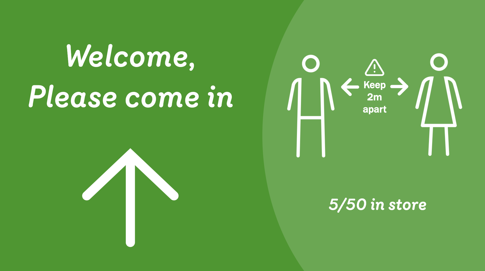
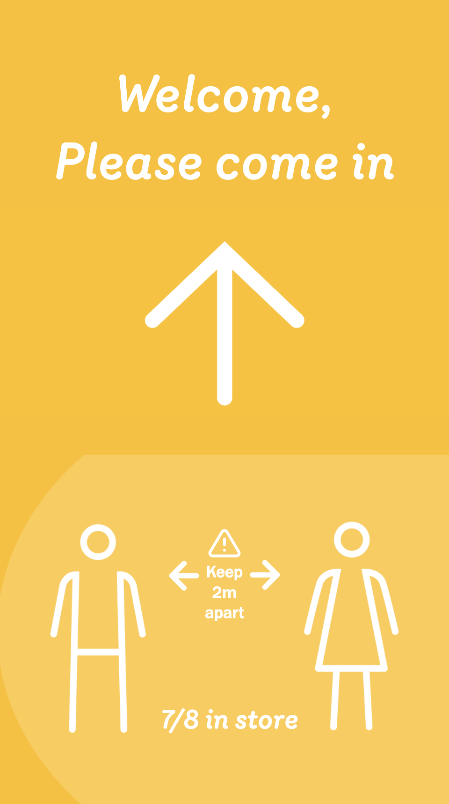
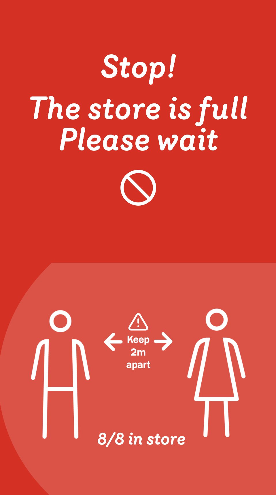

# {{applicationName}} #
by {{author}}

A short description will be displayed in application list.

 
 

This is a full description. All content starting from here will be displayed at the information section on app page. Markdown syntax is supported: [link](http://google.com)

Description file is not always published with the app. To publish the description run `omg app upload-description <app name>` or `yarn upload-description`.

## Headers:
- lists
- are
- also
- supported